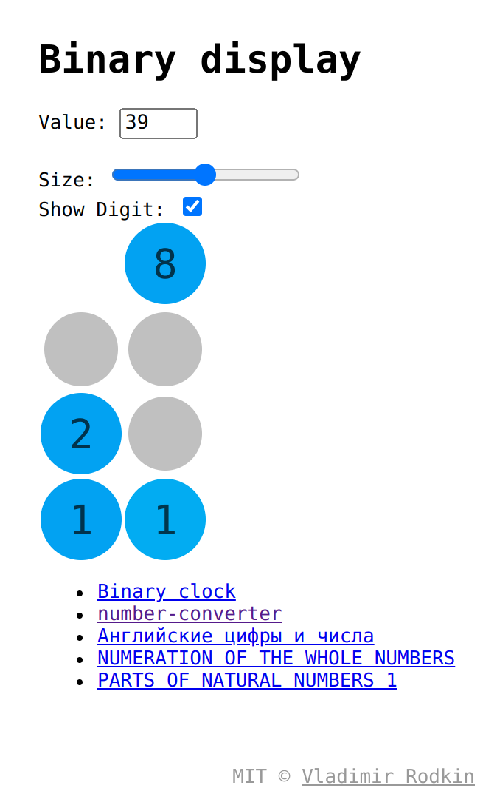

# binary-display

[![XO code style][codestyle-image]][codestyle-url]

[![Build Status][travis-image]][travis-url]

> Binary display

Demo: [vovanr.github.io/binary-display][demo]

## Docs

- [Seven-segment display](https://en.wikipedia.org/wiki/Seven-segment_display)
- [Big 7-segment Digital Clock](https://www.instructables.com/id/Big-7-segment-Digital-Clock/)
- [Bit](https://en.wikipedia.org/wiki/Bit)
- [Binary Digits](https://www.mathsisfun.com/binary-digits.html)

## License
MIT © [Vladimir Rodkin](https://github.com/VovanR)

[demo]: https://vovanr.github.io/binary-display

[codestyle-url]: https://github.com/xojs/xo
[codestyle-image]: https://img.shields.io/badge/code_style-XO-5ed9c7.svg?style=flat-square

[travis-url]: https://travis-ci.org/VovanR/binary-display
[travis-image]: https://img.shields.io/travis/VovanR/binary-display.svg?style=flat-square
